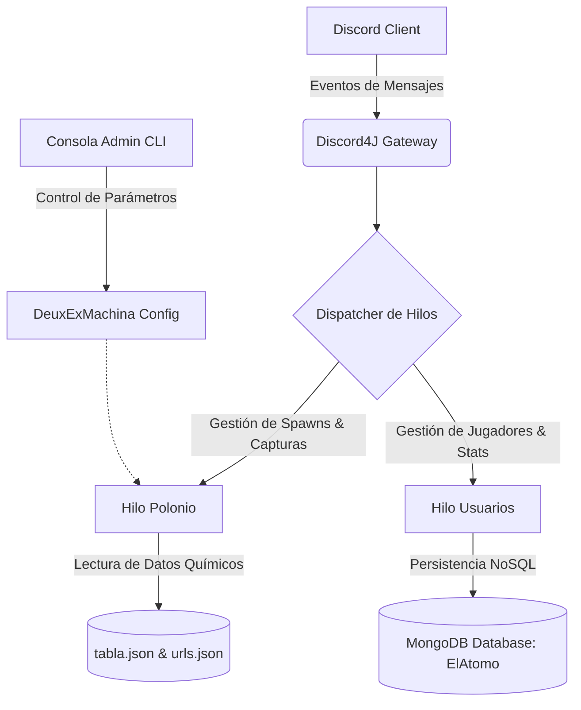

<div align="center">

# ⚛️ El Átomo — Discord Bot

[](https://www.oracle.com/java/)
[](https://discord4j.com/)
[](https://www.mongodb.com/)
[](https://gradle.org/)
[](https://www.gnu.org/licenses/gpl-3.0)
[](https://github.com/0x3C0x33/el-atomo)

<p align="center">
  <b>Un bot de Discord educativo e interactivo inspirado en <a href="https://poketwo.net/">Pokétwo</a>, donde los elementos de la tabla periódica cobran vida.</b>
  <br />
  <i>¡Gamificación, química cuántica y física de partículas directamente en tu servidor de Discord!</i>
</p>

---

</div>

## 📖 Sobre el Proyecto (About)

**El Átomo** es un proyecto desarrollado como **Trabajo de Fin de Ciclo (TFC)**. Su objetivo principal es transformar el aprendizaje de la física cuántica y la química en una experiencia dinámica, divertida y comunitaria dentro de **Discord**.

Inspirado en la mecánica de captura y coleccionismo de bots populares como *Pokétwo*, **El Átomo** hace que los 118 elementos de la tabla periódica aparezcan (*radien*) en los canales de texto mientras los usuarios conversan. Los miembros del servidor deben identificar y capturar el átomo correcto a partir de sus propiedades físicas y químicas reales antes de que se desintegre.

---

## ✨ Características Principales

- 🧪 **Mecánica de Radiación y Captura:** Los átomos aparecen aleatoriamente en los canales según el flujo de mensajes del chat o mediante invocación manual.
- 📊 **Embeds Científicos de Alta Precisión:** Cada elemento presenta un diseño enriquecido con datos oficiales:
  - Número atómico, símbolo químico y masa atómica ($u$).
  - Configuración electrónica completa y estados de oxidación.
  - Electronegatividad (escala Pauling), radio atómico ($pm$) y energía de ionización ($eV$).
  - Afinidad electrónica ($eV$), puntos de fusión y ebullición ($K$) y densidad ($g/cm^3$).
  - Código de color dinámico según su familia química (Alcalinos, Halógenos, Gases Nobles, Lantánidos, etc.).
- 🎯 **Sistema de Dificultad Adaptativa (0 a 3):**
  - **Nivel 0 (Libre):** Muestra todos los datos de forma explícita.
  - **Nivel 1 (Fácil):** Censura el nombre del elemento mediante ofuscación aleatoria.
  - **Nivel 2 (Normal):** Oculta tanto el nombre como el símbolo químico.
  - **Nivel 3 (Difícil):** Oculta múltiples propiedades clave, obligando a los jugadores a deducir el elemento a partir de constantes como su masa atómica, electronegatividad o configuración orbital.
- 👤 **Perfiles de Usuario & Persistencia (MongoDB):**
  - Registro de jugadores con estadísticas detalladas (`!perfil`).
  - Contador de átomos capturados clasificados por nivel de dificultad.
  - Personalización de frase célebre científica y átomo favorito.
- 🎛️ **Consola Administrativa Interactiva (CLI):** Panel en tiempo real para el anfitrión (`admin$bot>`) que permite ajustar dificultades, probabilidades y tiempos de captura sin reiniciar el bot.

---

## 🎮 Comandos Disponibles

### 💬 Comandos de Discord (Usuarios)

| Comando | Descripción |
| :--- | :--- |
| `!atomo` | Fuerza la aparición inmediata de un átomo en el canal actual. |
| `!<nombre_atomo>` | Intenta capturar el átomo en pantalla (ej: `!hidrogeno`, `!polonio`, `!hierro`). |
| `!cancelar` | Cancela el átomo activo actual en el canal. |
| `!crearUsuario` | Registra tu perfil en la base de datos de MongoDB. |
| `!perfil` | Muestra tu tarjeta de usuario, frase, átomo favorito y estadísticas de captura. |

---

### 💻 Comandos de Consola (Administrador / CLI)

Al arrancar el bot en local o en servidor, se inicia una terminal interactiva:

```text
admin$bot> ayuda
```

| Comando CLI | Descripción | Valor por Defecto |
| :--- | :--- | :--- |
| `ayuda` | Muestra la lista de comandos administrativos disponibles. | — |
| `cambiarDificultad` | Cambia el nivel de ofuscación de pistas (`0` a `3`). | `1` (Fácil) |
| `mensajesParaRadiar`| Número mínimo de mensajes necesarios en el chat para activar la probabilidad. | `10` msjs |
| `probabilidadParaRadiar` | Porcentaje de probabilidad (`0%` a `100%`) de aparición de un átomo. | `10%` |
| `tiempoCancelacion` | Tiempo límite en segundos para responder antes de que expire el átomo. | `60` seg |
| `salir` | Desconecta la sesión de Discord, cierra MongoDB y apaga el bot de forma segura. | — |

---

## 🏗️ Arquitectura y Tecnologías



* **Core:** Java 17 con arquitectura reactiva basada en [Project Reactor](https://projectreactor.io/) y [Discord4J](https://discord4j.com/).
* **Persistencia:** MongoDB con el driver oficial síncrono (`mongodb-driver-sync`).
* **Serialización:** Jackson Databind para el procesado de datos periódicos estructurados.
* **Construcción:** Gradle Wrapper multiplataforma.

---

## 🚀 Instalación y Despliegue Local

### 1. Requisitos Previos
- **Java JDK 17** o superior instalado.
- **MongoDB** en ejecución local en `mongodb://localhost:27017` (o instancia remota).
- Un **Bot Token de Discord** creado desde el [Discord Developer Portal](https://discord.com/developers/applications).

### 2. Clonar el Repositorio
```bash
git clone https://github.com/0x3C0x33/el-atomo.git
cd el-atomo
```

### 3. Configurar el Token de Discord
Abre el archivo `src/main/java/adrian/Main.java` y coloca tu token en la variable:
```java
private static final String TOKEN = "TU_DISCORD_BOT_TOKEN_AQUI";
```

### 4. Compilar y Ejecutar con Gradle
```bash
# En Windows:
gradlew.bat run

# En Linux / macOS:
./gradlew run
```

---

## 🔮 Hoja de Ruta y Recomendaciones Futuras

Para continuar evolucionando este proyecto tras el TFC, se recomiendan las siguientes mejoras:

- [ ] **Migración a Slash Commands (`/`):** Implementar los comandos de aplicación nativos de Discord con autocompletado y botones interactivos.
- [ ] **Sistema de Crafteo y Reacciones Químicas (*Fusión Molecular*):** Permitir a los usuarios combinar átomos capturados para sintetizar moléculas (ej: $2H + O \rightarrow H_2O$, $Na + Cl \rightarrow NaCl$) desbloqueando logros especiales.
- [ ] **Átomo-Dex & Sistema de Rarezas:** Vista de inventario coleccionable con filtros por estado de agregación, radiactividad o elementos sintéticos raros.
- [ ] **Gestión Segura con Variables de Entorno (`.env`):** Evitar tokens hardcodeados mediante el uso de `System.getenv("DISCORD_TOKEN")`.
- [ ] **Contenedor Docker (`docker-compose`):** Despliegue automatizado en un solo comando que levante el bot y el contenedor de MongoDB juntos.

---

## 👨‍💻 Autor

* **Adrián (0x3C0x33)** — *Desarrollo, Diseño y Arquitectura del Proyecto (TFC).*
* GitHub: [@0x3C0x33](https://github.com/0x3C0x33)

---

## 📄 Licencia

Este proyecto está licenciado bajo la **GNU General Public License v3.0 (GPL-3.0)**. Consulta el archivo [LICENSE](LICENSE) para más detalles.
